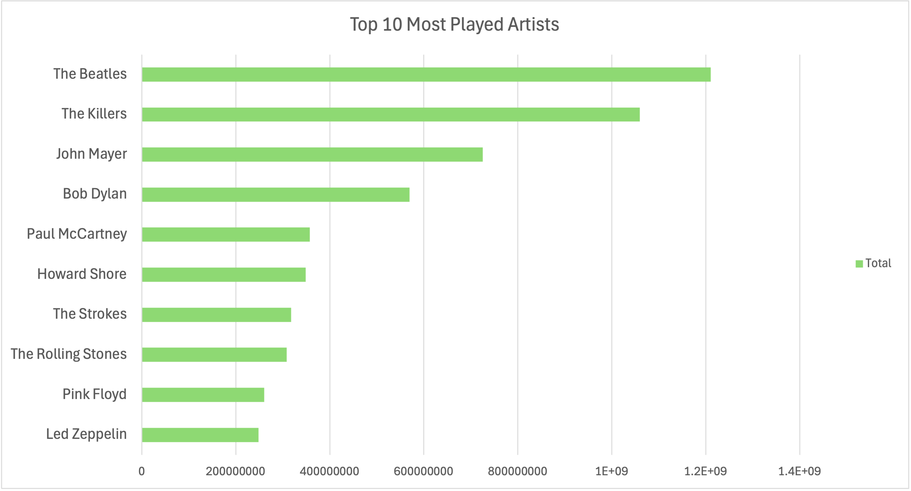
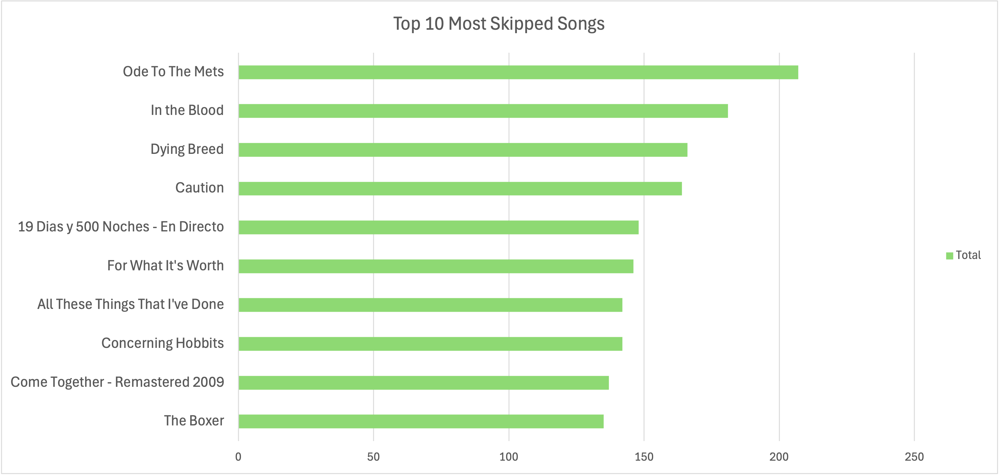
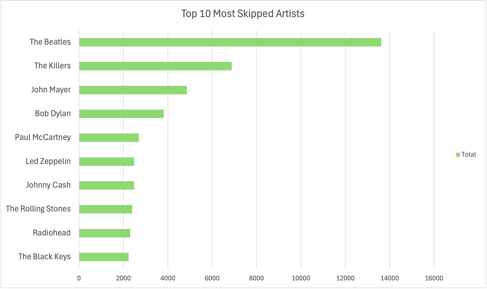

# 🎵 Spotify Listening Analysis (Excel Insights)

## **1️⃣ Most Played Songs**
✅ **Question:** Which songs have the highest total playtime?

### **📌 Method**
- **Tool Used:** Excel Pivot Table
- **Steps Taken:**
  - Created a Pivot Table:
    - **Rows:** `track_name`
    - **Values:** `Sum of ms_played`
  - Sorted `ms_played` in **descending order**.
  - Filtered **Top 10 Songs**.
  - Created a **Bar Chart** for visualization.

### **📊 Top 10 Most Played Songs**
| Rank | Song Name | Total Playtime (ms) |
|------|----------|---------------------|
| 1 | Ode To The Mets | 67,431,580 |
| 2 | The Return of the King (feat. Sir James Galway, Viggo Mortensen and Renée Fleming) | 64,401,661 |
| 3 | The Fellowship Reunited (feat. Sir James Galway, Viggo Mortensen and Renée Fleming) | 44,756,730 |
| 4 | 19 Dias y 500 Noches - En Directo | 42,914,042 |
| 5 | In The Blood | 38,427,087 |
| 6 | Claudia’s Theme - Version Eight | 37,120,900 |
| 7 | Dying Breed | 36,182,653 |
| 8 | The Breaking of the Fellowship (feat. "In Dreams") | 35,990,898 |
| 9 | All These Things That I’ve Done | 35,759,415 |
| 10 | Caution | 35,619,945 |

### **📈 Visualization**

### **🔍 Observations**
- "Ode To The Mets" is the **most played song**, with **67M milliseconds** of total playtime.
- Movie soundtracks (e.g., *Lord of the Rings* tracks) dominate the **top spots**.
- Rock & alternative songs (*The Killers, The Strokes*) have high engagement.

## **2️⃣ Most Played Artists**
✅ **Question:** Which artists have the highest total playtime?

### **📌 Method**
- **Tool Used:** Excel Pivot Table
- **Steps Taken:**
  - Created a Pivot Table:
    - **Rows:** `artist_name`
    - **Values:** `Sum of ms_played`
  - Sorted `ms_played` in **descending order**.
  - Filtered **Top 10 Artists**.
  - Created a **Bar Chart** for visualization.

### **📊 Top 10 Most Played Artists**
| Rank | Artist Name | Total Playtime (ms) |
|------|------------|---------------------|
| 1 | The Beatles | 1,210,184,552 |
| 2 | The Killers | 1,059,556,516 |
| 3 | John Mayer | 725,219,443 |
| 4 | Bob Dylan | 569,456,936 |
| 5 | Paul McCartney | 357,354,370 |
| 6 | Howard Shore | 348,930,675 |
| 7 | The Strokes | 317,508,419 |
| 8 | The Rolling Stones | 307,917,009 |
| 9 | Pink Floyd | 260,531,842 |
| 10 | Led Zeppelin | 248,338,279 |

### **📈 Visualization**

### **🔍 Observations**
- **The Beatles** have the highest total playtime, making them the most popular artist in this dataset.
- **The Killers & John Mayer** follow closely behind.
- **Howard Shore’s presence** suggests a strong interest in soundtracks (*Lord of the Rings*).
- Rock and alternative bands dominate the **top 10**.

## **3️⃣ Top 10 Most Skipped Songs**
✅ **Question:** Which songs get skipped the most?

### **📌 Method**
- **Tool Used:** Excel Pivot Table
- **Steps Taken:**
  - Created a Pivot Table:
    - **Rows:** `track_name`
    - **Values:** `Count of skipped_boolean`
  - Sorted `skipped_boolean` in **descending order**.
  - Filtered **Top 10 Skipped Songs**.
  - Created a **Bar Chart** for visualization.

### **📊 Top 10 Most Skipped Songs**
| Rank | Song Name                                     | Skip Count |
|------|-----------------------------------------------|------------|
| 1    | The Boxer                                     | 135        |
| 2    | Come Together - Remastered 2009              | 137        |
| 3    | Concerning Hobbits                           | 142        |
| 4    | All These Things That I've Done               | 142        |
| 5    | For What It's Worth                           | 146        |
| 6    | 19 Dias y 500 Noches - En Directo             | 148        |
| 7    | Caution                                       | 164        |
| 8    | Dying Breed                                   | 166        |
| 9    | In the Blood                                  | 181        |
| 10   | Ode To The Mets                               | 207        |

### **📈 Visualization**

### **🔍 Observations**
- **"Ode To The Mets"** is the **most skipped song**, but it still ranks as one of the most played songs.
- Several songs with **high skips** still remain popular in terms of playtime, suggesting listeners might not finish them.
- **"Caution"** and **"The Boxer"** are among the more frequently skipped tracks.

## **4️⃣ Top 10 Most Skipped Artists**
✅ **Question:** Which artists get skipped the most?

### **📌 Method**
- **Tool Used:** Excel Pivot Table
- **Steps Taken:**
  - Created a Pivot Table:
    - **Rows:** `artist_name`
    - **Values:** `Count of skipped_boolean`
  - Sorted `skipped_boolean` in **descending order**.
  - Filtered **Top 10 Skipped Artists**.
  - Created a **Bar Chart** for visualization.

### **📊 Top 10 Most Skipped Artists**
| Rank | Artist Name    | Skip Count |
|------|----------------|------------|
| 1    | The Beatles    | 13,621     |
| 2    | The Killers    | 6,878      |
| 3    | John Mayer     | 4,855      |
| 4    | Bob Dylan      | 3,814      |
| 5    | Paul McCartney | 2,697      |
| 6    | Led Zeppelin   | 2,482      |
| 7    | Johnny Cash    | 2,478      |
| 8    | The Rolling Stones | 2,390  |
| 9    | Radiohead      | 2,305      |
| 10   | The Black Keys | 2,231      |

### **📈 Visualization**

### **🔍 Observations**
- **The Beatles** have the highest skip count, making them the most skipped artist in this dataset.
- **The Killers** and **John Mayer** also appear as artists with high skip rates, suggesting that despite being popular, listeners tend to skip their songs often.
- **Rock bands** like **Radiohead, Led Zeppelin,** and **The Rolling Stones** are more likely to be skipped.

## **5️⃣ Artist Dependency on Top Songs**
✅ **Question:** Is an artist's popularity due to one hit or multiple songs?

### **📌 Method**
- **Tool Used:** Excel Pivot Table
- **Steps Taken:**
  - Created a Pivot Table:
    - **Rows:** `artist_name` + `track_name`
    - **Values:** `Sum of ms_played`
  - **Calculated:** Total playtime of each artist and their tracks.
  - This analysis shows whether an artist's total playtime is driven by one major hit or multiple tracks.
  
### **🔍 Observations**
- In this analysis, we reviewed artists and their track playtime to see if the total playtime is contributed by a few top tracks or is spread across multiple songs.
- Based on this data, we couldn’t calculate the **% contribution** of top songs using Excel due to complexity.
- **Next Step:** For more detailed insights and further analysis on **hit songs** and **artist dependency**, we decided to proceed with **SQL**. This will allow for easier calculations of metrics like top 3 songs' playtime percentage.

---

## **6️⃣ Artist Dependency Based on Top 3 Tracks**
✅ **Question:** How does an artist's ranking change when we only consider their top 3 tracks?

### **📌 Method**
- **Tool Used:** Excel Pivot Table
- **Steps Taken:**
  - Created a Pivot Table:
    - **Rows:** `artist_name`
    - **Values:** `Sum of ms_played`
    - Filtered for **Top 3 tracks** per artist.
  - This helped us analyze if an artist’s ranking in terms of playtime changes when only the top 3 tracks are considered.
  
### **🔍 Observations**
- After filtering for the **Top 3 tracks**, the order of the artists changed significantly, indicating the importance of **hit tracks** in driving an artist's popularity.
- **Excel Limitation:** Due to Excel’s limitations, we could not further analyze **percentage contributions** or **skip rate**. Hence, we have decided to proceed with **SQL** for deeper insights into **artist dependency**, **skip rates**, and more detailed calculations.

---

### **🔧 Why We Moved to SQL**
While Excel provided a basic overview of artist playtimes and song contributions, we encountered several limitations:
1. **Complex Calculations:** Excel was not suitable for calculating percentages or detailed analytics such as comparing an artist's top 3 tracks' contribution to their total playtime.
2. **Data Complexity:** Managing large data sets and performing advanced analytics (like calculating the percentage of total playtime from the top 3 songs) was inefficient in Excel.
3. **Next Steps:** We chose **SQL** for more efficient querying, aggregation, and calculation to handle these types of questions.

