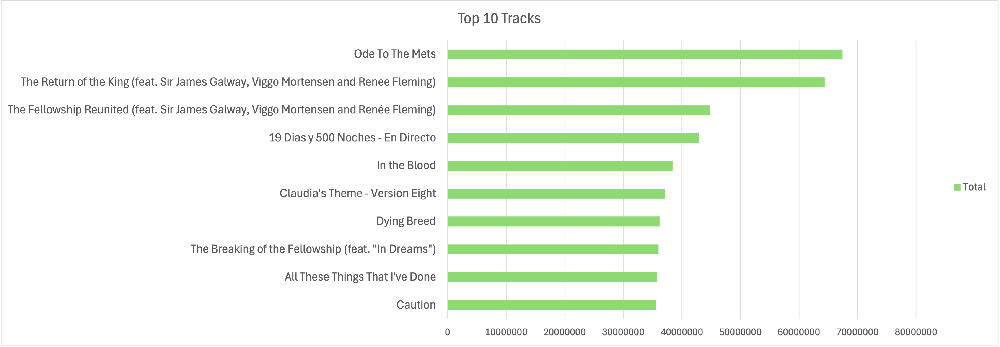

# 🎵 Spotify Listening Analysis (Excel Insights)

## **1️⃣ Most Played Songs**
✅ **Question:** Which songs have the highest total playtime?

### **📌 Method**
- **Tool Used:** Excel Pivot Table
- **Steps Taken:**
  - Created a Pivot Table:
    - **Rows:** `track_name`
    - **Values:** `Sum of ms_played`
  - Sorted `ms_played` in **descending order**.
  - Filtered **Top 10 Songs**.
  - Created a **Bar Chart** for visualization.

### **📊 Top 10 Most Played Songs**
| Rank | Song Name | Total Playtime (ms) |
|------|----------|---------------------|
| 1 | Ode To The Mets | 67,431,580 |
| 2 | The Return of the King (feat. Sir James Galway, Viggo Mortensen and Renée Fleming) | 64,401,661 |
| 3 | The Fellowship Reunited (feat. Sir James Galway, Viggo Mortensen and Renée Fleming) | 44,756,730 |
| 4 | 19 Dias y 500 Noches - En Directo | 42,914,042 |
| 5 | In The Blood | 38,427,087 |
| 6 | Claudia’s Theme - Version Eight | 37,120,900 |
| 7 | Dying Breed | 36,182,653 |
| 8 | The Breaking of the Fellowship (feat. "In Dreams") | 35,990,898 |
| 9 | All These Things That I’ve Done | 35,759,415 |
| 10 | Caution | 35,619,945 |

### **📈 Visualization**

### **🔍 Observations**
- "Ode To The Mets" is the **most played song**, with **67M milliseconds** of total playtime.
- Movie soundtracks (e.g., *Lord of the Rings* tracks) dominate the **top spots**.
- Rock & alternative songs (*The Killers, The Strokes*) have high engagement.

